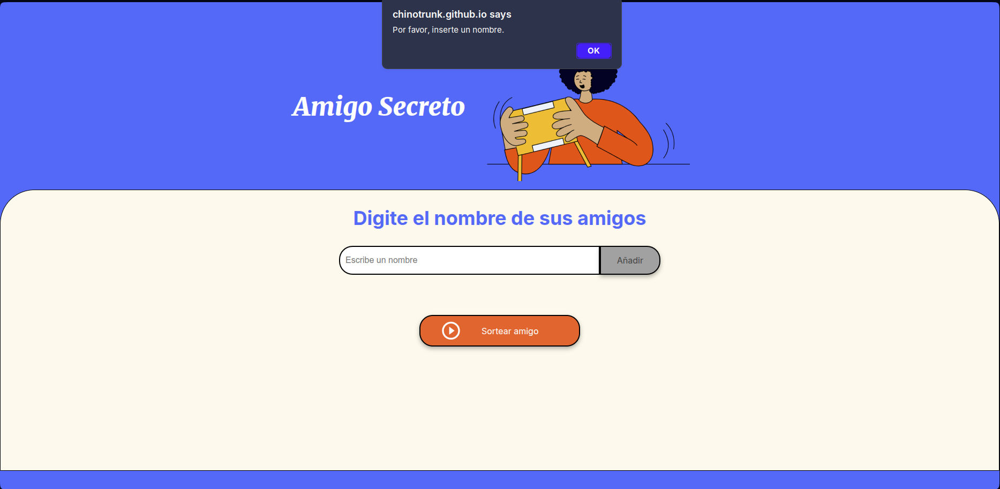
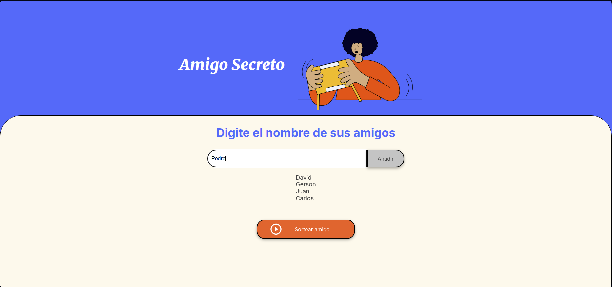
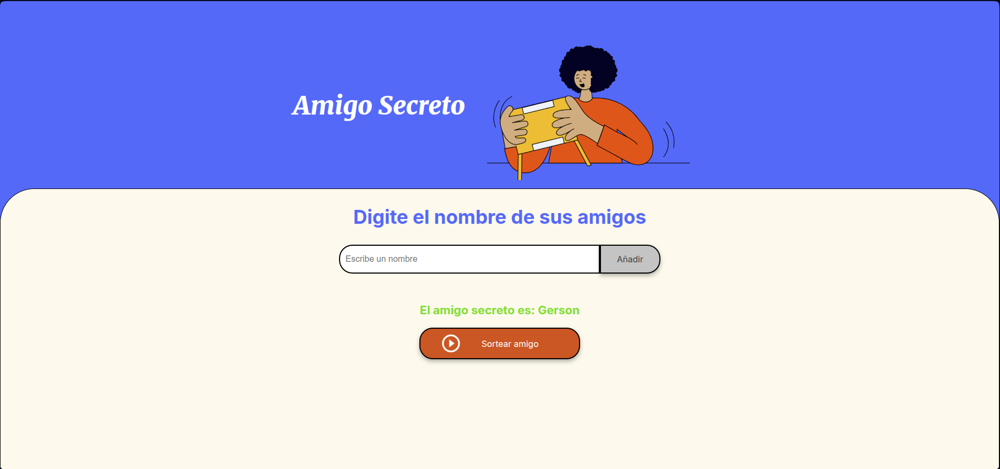

# 🎁 Proyecto Amigo Secreto

👉 **Accede al proyecto aquí:**  
[https://chinotrunk.github.io/challenge-amigo-secreto](https://chinotrunk.github.io/challenge-amigo-secreto)

---

Este proyecto permite realizar un sorteo de "Amigo Secreto" de forma sencilla y rápida.  

---

## 📌 Funcionalidades

- ✅ Agregar nombres a la lista de participantes.
- ✅ Validación para evitar nombres vacíos.
- ✅ Eliminar nombres individualmente.
- ✅ Mensajes de advertencia si se intenta sortear sin participantes.
- ✅ Sorteo aleatorio entre los nombres registrados.
- ✅ Reinicio del sorteo y lista.
- ✅ Interfaz clara.

---

## 🖼️ Capturas de pantalla

### ⚠️ Validación vacía

### ➕ Agregar nombre

### 🎲 Sorteo

---

## 🛠️ Tecnologías utilizadas

- HTML5
- CSS
- JavaScript 

---

## 🧑‍💻 Autor

**David Lima** 
🔗 [GitHub](https://github.com/chinotrunk)
🔗 [LinkedIn](https://www.linkedin.com/in/david-gerson-lima)

---

## 📚 Proyecto desarrollado en

Este proyecto fue realizado como parte del programa **Oracle Next Education (ONE)** en colaboración con **Alura Latam**.
